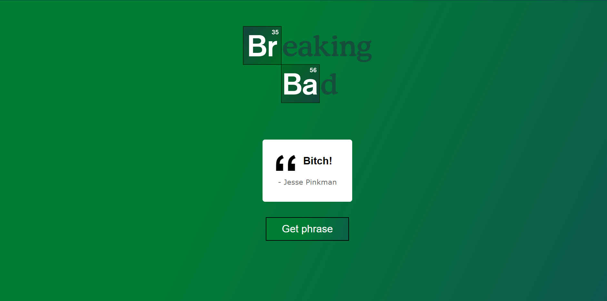

In this react project you can get a phrase from the 'Breaking Bad' series:

Topics that I learned during this project:

-The use of useEffect

-How to do an API call using fetch

API: https://github.com/shevabam/breaking-bad-quotes

How it looks like:

Made with ❤️ by Antonio Salazar

😗
